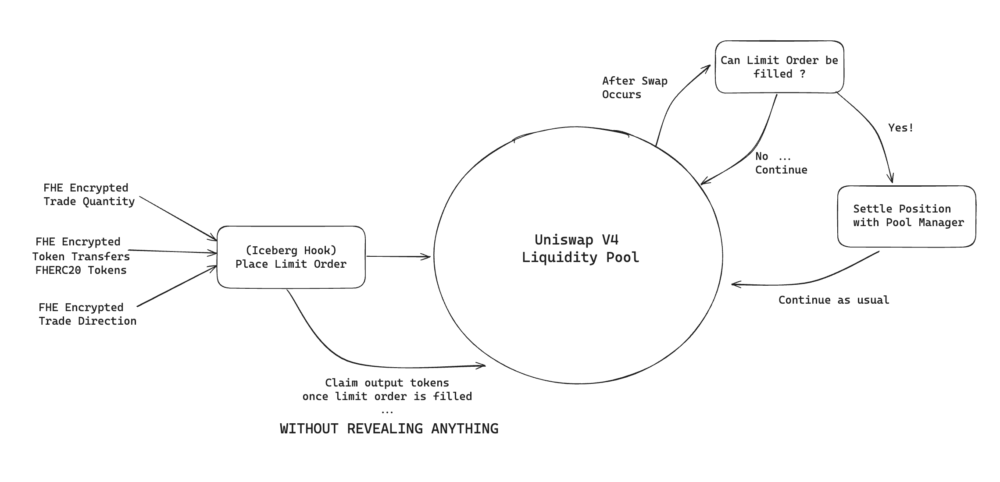

# :snowflake: Iceberg :snowflake: 🦄

## Intro
FHE-enabled privacy preserving Limit Order 'iceberg' hook built on top of Uniswap V4.
It allows users to place encrypted limit orders without revealing trade details such as trade size, price and trade direction.
This is done using the FHE capabilities from Fhenix Protocol.


## Trade Lifecycle ... Where does Iceberg fit in ??


1. User places a new encrypted limit order order using the iceberg hook.
2. The encrypted tokens are transferred to the hook
3. An encrypted receipt is minted to the user.
4. The order remains in the Iceberg hook until the price crosses the limit price.
5. Once the price crosses, the funds are unwrapped and swapped at the market rate in the liquidity pool.
6. The outstanding balances are then settled with the liquidity pool.
7. The tokens are re-encrypted once received by the Iceberg hook.
8. Once the user claims the tokens using the receipt they receive an encrypted transfer of the trade output.

This all happens WITHOUT REVEALING TRADE DETAILS!!!

## Set up

*requires [foundry](https://book.getfoundry.sh)*

```
forge install
bun install

forge test -vvvv --via-ir
```

## Structure
`/src/Iceberg.sol` - Iceberg Hook    
`/src/FHERC20.sol` - Custom FHE-enabled ERC20 impl    
`/src/FHERC6909.sol` - Custom FHE-enabled ERC6909 impl    
`/script/Bridge.s.sol` - Fhenix Bridge Run Script    
`/test/Iceberg.t.sol` - Iceberg Hook Test Suite    
`/test/utils/...` - Test Utilities    

Additional resources:

[Fhenix Docs](https://docs.fhenix.zone/)

[Fhenix Cheat Sheet](https://www.fhenix.io/cheat-sheet/)

[Uniswap v4 docs](https://docs.uniswap.org/contracts/v4/overview)

[v4-periphery](https://github.com/uniswap/v4-periphery) contains advanced hook implementations that serve as a great reference

[v4-core](https://github.com/uniswap/v4-core)

[v4-by-example](https://v4-by-example.org)

